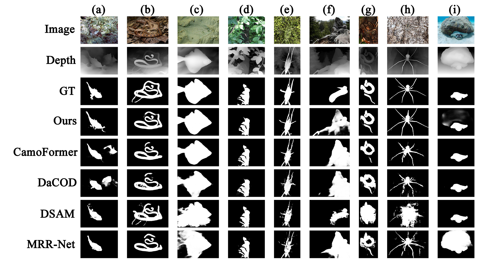

# CUINet

A Camouflaged Object Detection Method Based on Cross-modal Unidirectional Injection Fusion
(Published in IET Image Processing)


This repository provides the **dataset** and **prediction results** used in our CUINet study for **Camouflaged Object Detection (COD)**.
 All data are released for research and academic purposes only.



<center><b>Qualitative comparison of different COD methods. </b></center>


<center><b>The PR curves (first row) and F-measure curves (second row) of COD-related competitors on three popular datasets. The curve for our model is shown as a solid red line. </b></center>

## Contents

### 1.Datasets

All training and test sets can be found at the following link: 

https://drive.google.com/drive/folders/1yCA88_sjN2P_AD8k2kIquSMQqzizGeMI?usp=drive_link 

The images include RGB images, ground-truth images, and two depth images generated by monocular depth estimation models (Depth-Anything-V2 and Midas v3.1).

### 2.Prediction Maps

Prediction maps for the CUINet model on the three datasets can be found here: 

https://drive.google.com/drive/folders/1jcEicu5YgPjq5XuFMluP1bO29DmwjU16?usp=drive_link

## Paper

```latex
@article{Dai2025CUINet,
  title={A Camouflaged Object Detection Method Based on Cross-modal Unidirectional Injection Fusion},
  author={Kun Dai, Chunyu Han},
  journal={IET Image Processing},
  year={2025}
}
```

